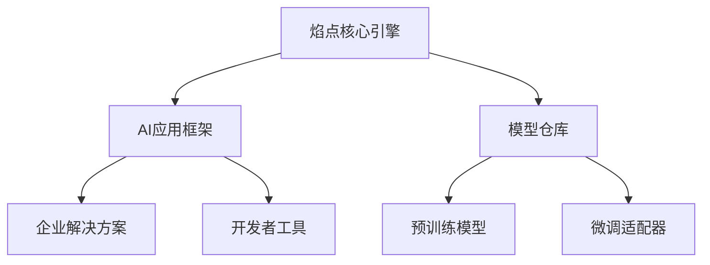

# 🔥 欢迎来到焰点科技 FlameDot.TECH

<div align="center">
  
  <h1>焰点科技 | FlameDot.TECH</h1>
  <p>点燃智能未来 · 照亮创新边界</p>
  
  [](https://github.com/FlameDot-TECH)
  [](https://opensource.org/licenses/Apache-2.0)
  [](https://twitter.com/FlameDot_TECH)
</div>

## 🚀 我们是谁

焰点科技（FlameDot.TECH）致力于成为**AI原生时代的创新引擎**，专注于：

- 🔥 **大模型应用开发**  
- 🧠 **生成式AI解决方案**  
- ⚡ **高性能计算架构**  
- 🌐 **开源技术生态建设**  

> "从星火到燎原，我们点燃每一行代码的智慧火焰"

## 🌟 核心项目

### [FlameCore-Engine](https://github.com/FlameDot-TECH/FlameCore-Engine)
```python
# 下一代AI推理引擎
from flamecore import QuantumInference

engine = QuantumInference(model="flame-ultra")
engine.predict("用技术温暖世界")
```
> ⚡ 支持百亿级参数的分布式推理框架  
> 🚀 比传统方案提升3倍推理速度  
> 🌈 多模态输入/输出支持

### [PyroTorch](https://github.com/FlameDot-TECH/PyroTorch)
```python
# 动态计算图框架
import pyrotorch as pt

model = pt.ignite(
    layers=[512, 'relu', 256, 'swish'],
    optimizer='nova'
)
```
> 🔥 专为生成式AI设计的训练框架  
> ❄️ 自动混合精度训练  
> 📦 零配置分布式训练

### [InfernoDB](https://github.com/FlameDot-TECH/InfernoDB)
```markdown
| 特性             | 传统数据库 | InfernoDB |
|------------------|------------|-----------|
| 向量检索速度     | 1x         | **27x**   |
| AI原生查询       | ❌         | ✅        |
| 动态schema       | ❌         | ✅        |
```
> 🔍 全球首个AI原生向量数据库  
> 🌪️ 支持实时语义检索  
> 🧩 无缝对接大模型生态

## 🛠️ 技术栈

<div align="center">
  
  
  
  
  
</div>

## 📊 开源图谱



## 🤝 加入我们

```markdown
- **贡献代码**：查看 [CONTRIBUTING.md](https://github.com/FlameDot-TECH/.github/CONTRIBUTING.md)
- **报告问题**：[新建Issue](https://github.com/FlameDot-TECH/.github/issues)
- **技术交流**：`community.flamedot.tech`
```

## 🌍 联系我们

<div align="center">
  <a href="https://flamedot.tech">
    
  </a>
  <a href="mailto:contact@flamedot.tech">
    
  </a>
  <a href="https://discord.gg/flamedot">
    
  </a>
</div>

---

> ✨ **在代码的宇宙中，我们既是燃火者，也是追光者**  
> © 2023 焰点科技 | 开源驱动创新，技术温暖世界
```
````